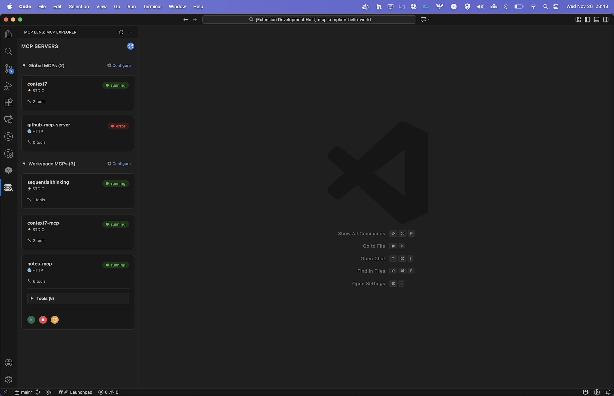
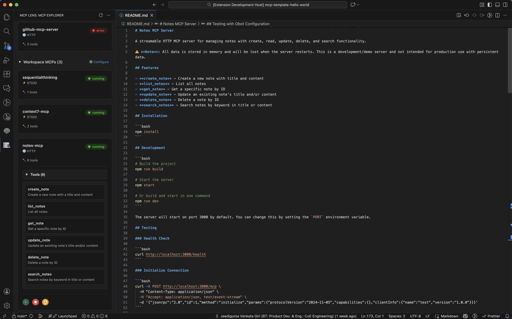
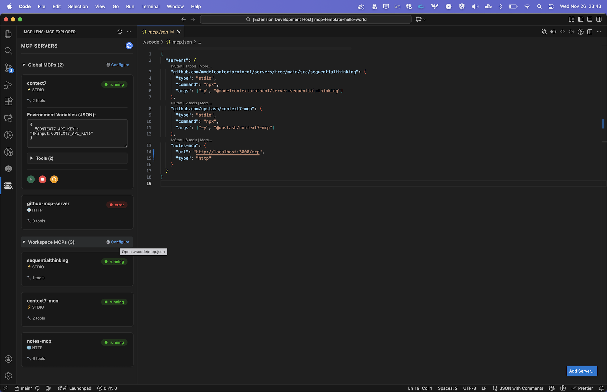

# MCP Lens

**An interactive Visual Studio Code extension for exploring and managing Model Context Protocol (MCP) servers**

---

> **✨ Essential for GitHub Copilot & VS Code Copilot Users**
> 
> If you're an avid Copilot user working with Model Context Protocol (MCP) servers, this extension is a must-have for managing and monitoring your MCP configurations.

---

## Why MCP Lens?

As MCP servers become integral to AI-powered development workflows, managing multiple configurations can be challenging. MCP Lens provides:

- **Visual Management**: See all your MCP servers (global and workspace-specific) in one elegant view
- **Real-Time Monitoring**: Watch servers start, monitor tool counts, and track status changes live
- **Easy Configuration**: Quick access to edit your `mcp.json` files with proper validation
- **Developer-Friendly**: Built by developers, for developers who work with Copilot and MCP daily

## Features

- 🌍 **Automatic Discovery**: Detects MCP configurations from global VS Code settings and workspace `mcp.json` files
- 🔍 **Beautiful Interface**: Clean, card-based UI with real-time status indicators and tool information
- ⚡ **Server Control**: Start, stop, and restart MCP servers with one click
- 📊 **Live Updates**: See tool counts and status changes as servers load
- 🎯 **Smart Filtering**: Toggle between global MCPs, workspace MCPs, or view both
- 🔧 **Quick Configuration**: Direct links to edit your MCP configuration files
- 🎨 **Theme-Aware**: Adapts seamlessly to your VS Code theme

## Screenshots

### 1. MCP Server List View
Clean, card-based interface showing all your MCP servers with real-time status indicators and tool counts.

### 2. Server Tools Information
Comprehensive view of individual MCP servers with detailed tool information and capabilities.

### 3. Configuration Management
Quick access to configure your MCP servers and edit configuration files.

## Quick Start

1. **Open MCP Lens**: Click the MCP Lens icon in the Activity Bar (left sidebar)
2. **View Your Servers**: The extension automatically discovers:
   - **Global MCPs**: From your VS Code user `mcp.json`
   - **Workspace MCPs**: From `mcp.json` in your project root
3. **Manage Servers**: Use the play/stop/restart buttons to control servers
4. **Configure**: Click "Configure" links to edit your MCP configuration files

## Installation

Search for "MCP Lens" in the VS Code Extensions marketplace and click Install.

## Support

**Current Version (v1.0):**
- ✅ **Visual Studio Code**: Fully supported
- 🔜 **Other IDEs**: Support for additional IDEs will be released based on community adoption and feedback

We're committed to expanding IDE support in future releases. If you'd like to see MCP Lens in your favorite IDE, please [let us know](https://github.com/mcp-lens/mcp-lens/issues/new?template=feature_request.yml)!

## Contributing

Contributions are welcome! We appreciate bug reports, feature requests, and pull requests.

**Ways to Contribute:**
- 🐛 [Report a Bug](https://github.com/mcp-lens/mcp-lens/issues/new?template=bug_report.yml)
- ✨ [Request a Feature](https://github.com/mcp-lens/mcp-lens/issues/new?template=feature_request.yml)
- 📖 [Improve Documentation](https://github.com/mcp-lens/mcp-lens/issues/new?template=documentation.yml)
- 💬 [Start a Discussion](https://github.com/mcp-lens/mcp-lens/issues/new?template=discussion.yml)

Please see our [Contributing Guidelines](CONTRIBUTING.md) and [Code of Conduct](CODE_OF_CONDUCT.md) for more details.

**Development Quick Start:**
1. Fork the repository
2. Create a feature branch (`git checkout -b feature/amazing-feature`)
3. Commit your changes (`git commit -m 'Add amazing feature'`)
4. Push to the branch (`git push origin feature/amazing-feature`)
5. Open a Pull Request

## License

MIT License - see the [LICENSE](LICENSE) file for details.

## Author

**Giri Jeedigunta**
- GitHub: [@giri-jeedigunta](https://github.com/giri-jeedigunta)
- Email: giri.jeedigunta@gmail.com

---

**Enjoy seamless MCP management with MCP Lens!** 🚀
